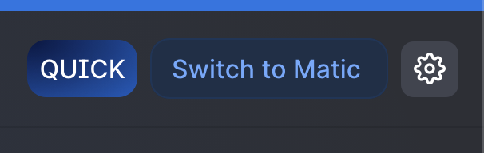
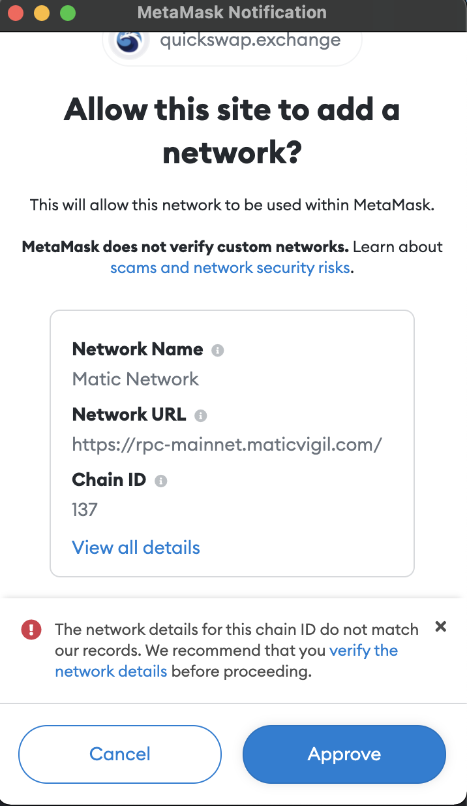
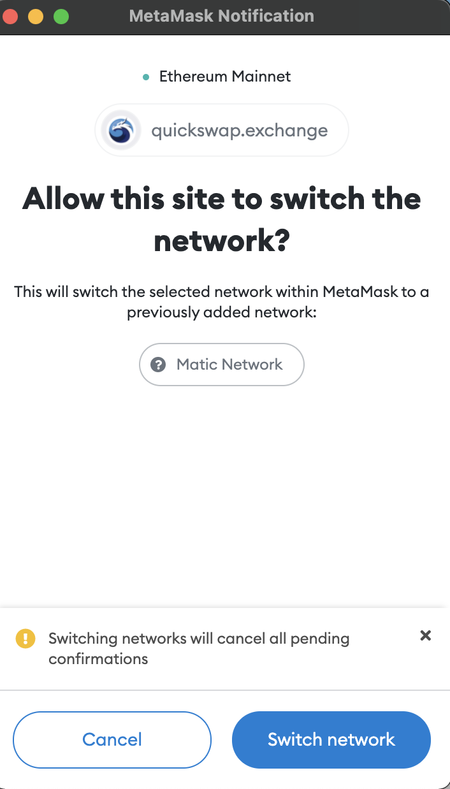

# Metamask

1. Create Metamask Wallet [https://metamask.io/](https://metamask.io/)
2. Go to [https://quickswap.exchange/\#/swap](https://quickswap.exchange/#/swap) 
3. Click Switch to Matic top right corner

   

4. A Metamask popup will appear. Click Approve &gt; Switch Network

1. Search any required tokens on the quickswap inputs, e.g. DAI, ETH, USDC and click the + sign to add them to your Metamask

