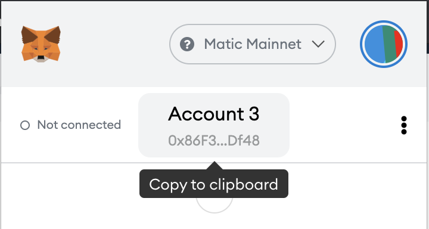

# AscendEx

AscendEx \(formerly Bitmax\) is a crypto exchange allowing direct withdrawals into the Matic network.

Feels for withdrawal to Matic are typically lower than using a Bridge.

Note: you must be registered for at least 24 hours before you are allowed to withdraw funds.

They also allow some crypto token purchases directly via card payment \(with a 2% fee charge\).

1. Register in AscendEx [https://ascendex.com/register](https://ascendex.com/register?inviteCode=U7UMHICWY)
2. Buy **USDT** with card payment - currently AscendEx only has a MATIC/USDT market:
   1. In AscendEx go to Fiat Payment &gt; Bank Card Payment
   2. Follow instructions from the payment processor
   3. You will need an ID / Passport to verify to process the payments
   4. Video showing how to buy a token from 1:00 - 3:50 [https://youtu.be/V9qnqq1Tu98?t=69](https://youtu.be/V9qnqq1Tu98?t=69)
3. Buy MATIC with your USDT: [https://ascendex.com/en/basic/cashtrade-spottrading/usdt/matic](https://ascendex.com/en/basic/cashtrade-spottrading/usdt/matic)
4. Withdraw MATIC to Matic metamask wallet 1. Go to [https://ascendex.com/en/assets/assets-withdraw/MATIC](https://ascendex.com/en/assets/assets-withdraw/MATIC) 2. Ensure to select the Matic network

   ```text
    
   ```

   1. Copy your account address from metamask and paste it into the withdrawal address on AscendEx

      

5. Once the Matic token is in your wallet you can swap it for other tokens on Quickswap, see [Matic coin exchange on Quickswap](ascendex.md)

