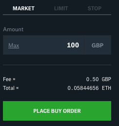
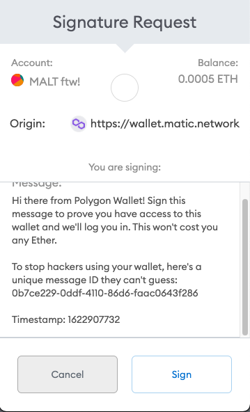
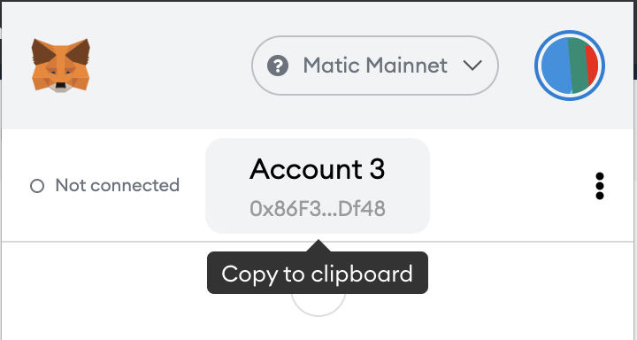

# Coinbase

Coinbase is a convenient option, especially for users in the US, Canada, UK and Europe.

Sending Fiat in your account typically is a bank transfer with low or no fees.

1. Register in Coinbase; this automatically registers the same account into CoinbasePro, the trader version of Coinbase which charges less fees for crypto trades

   [https://www.coinbase.com/](https://www.coinbase.com/join/ivanov_5g)

2. Deposit fiat in CoinbasePro [https://pro.coinbase.com/](https://pro.coinbase.com/) \(if you verify with ID\) or Coinbase \(you can transfer funds from Coinbase to CoinbasePro free of charge\).

   Help how to do that, see Funding your account section: [https://help.coinbase.com/en/pro/managing-my-account](https://help.coinbase.com/en/pro/managing-my-account)

3. Purchase ETH - this is the most fool proof token to buy, as you will be paying gas in ETH. You can swap ETH to anything later when you have bridged it to ETH on Matic.

   Select the correct Fiat - ETH market and purchase [https://pro.coinbase.com/trade/](https://pro.coinbase.com/trade/BTC-GBP)

   

4. Withdraw ETH to Metamask wallet 1. Go to Portfolios [https://pro.coinbase.com/portfolios](https://pro.coinbase.com/portfolios) 2. Click Withdraw &gt; Select ETH &gt; Crypto Address 3. Copy your account address from Metamask and paste it into the To address

   ```text
    
   ```

   1. Fill in the amount \(or hit Max\). The transaction fee is displayed in Network fee and that's given in ETH.
   2. Click Withdrawal at the bottom.

      The ETH will show eventually in your Metamask account when you have the Ethereum Mainnet network selected.

      

5. Go to [https://wallet.matic.network/bridge/](https://wallet.matic.network/bridge/) to transfer the ETH to Matic
6. Connect Metamask wallet and Sign

   

7. Fill in ETH balance to transfer and hit Transfer

   

8. Do any further exchanges, see [Matic coin exchange on Quickswap](coinbase.md) and [Swap Matic USDC for DAI on Curve](coinbase.md)

## Fiat to Matic via Coinbase & AscendEx \(avoid Polygon bridge\)

1. Register in Coinbase; this automatically registers the same account into CoinbasePro, the trader version of Coinbase which charges less fees for crypto trades

   [https://www.coinbase.com/](https://www.coinbase.com/join/ivanov_5g)

2. Deposit fiat in CoinbasePro [https://pro.coinbase.com/](https://pro.coinbase.com/) \(if you verify with ID\) or Coinbase \(you can transfer funds from Coinbase to CoinbasePro free of charge\).

   Help how to do that, see Funding your account section: [https://help.coinbase.com/en/pro/managing-my-account](https://help.coinbase.com/en/pro/managing-my-account)

3. Register in AscendEx [https://ascendex.com/register](https://ascendex.com/register?inviteCode=U7UMHICWY) - note: you must be registered for at least 24 hours before you are allowed to withdraw funds

From here, there are a few options.

### Buy Matic directly from CoinbasePro

Buy MATIC in CoinbasePro and send to AscendeEx, but you will also need some ETH as the transfer is done via the Ethereum network.

Note: Currently CoinbasePro require a minimum of 81 MATIC to be sent.

1. In CoinbasePro, go to Portfolios &gt; Withdraw &gt; Select Matic &gt; Crypto Address
2. Obtain the Crypto address from AscendEx: [https://ascendex.com/en/assets/assets-recharge/MATIC](https://ascendex.com/en/assets/assets-recharge/MATIC) &gt; Copy the MATIC\(Polygon\) Deposit Address
3. Paste this into the CoinbasePro transaction window, fill in amounts, then click Withdrawal
4. Withdraw MATIC to Matic metamask wallet 1. Go to [https://ascendex.com/en/assets/assets-withdraw/MATIC](https://ascendex.com/en/assets/assets-withdraw/MATIC) 2. Ensure to select the Matic network

   ```text
    
   ```

   1. Copy your account address from metamask and paste it into the withdrawal address on AscendEx

      

5. Once the Matic token is in your wallet you can swap it for other tokens on Quickswap, see [Matic coin exchange on Quickswap](coinbase.md)

### Buy USDC in CoinbasePro and send to AscendEx

This is ideal when sending smaller amounts than the minimum Matic allowed to send from Coinbase.

The process is the same as with Matic above, just pick USDC instead of Matic where relevant.

