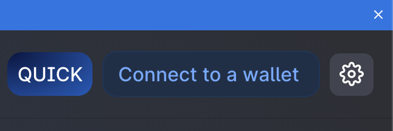
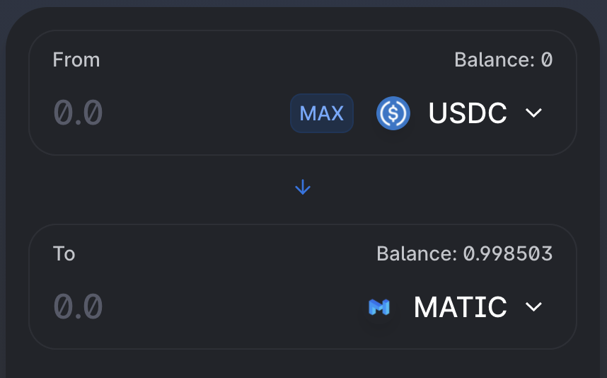

# Using quickswap

1. Go to [https://quickswap.exchange/\#/swap](https://quickswap.exchange/#/swap) and Connect your wallet

   

2. Select the required From - To coin pair in the swap window, enter the amounts and click Swap.

   

