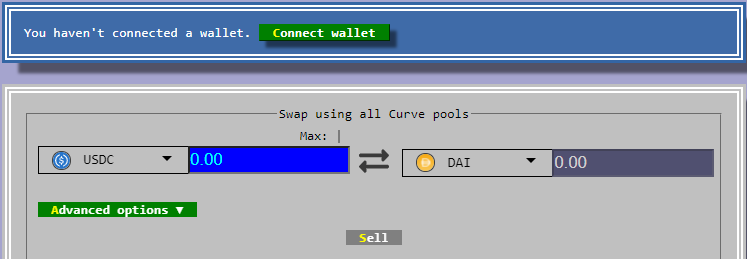

# Swapping into DAI on Curve

Best rate to swap USDC for DAI \(or any stablecoin on Matic\) is on Curve: [https://polygon.curve.fi/](https://polygon.curve.fi/)

1. Ensure Metamask wallet has "Matic Mainnet" selected in the Network tab

   

2. Ensure you have some Matic into the account. If not, get some free Matic from [https://matic.supply/](https://matic.supply/)
3. Go to Curve  [https://polygon.curve.fi/](https://polygon.curve.fi/)
4. Connect wallet, approve and Sell USDC for DAI

   

